<picture><source media="(max-width: 719px)" srcset="./assets/header-mobile.svg"><source media="(min-width: 720px)" srcset="./assets/header.svg"></picture> <picture><source media="(max-width: 719px)" srcset="./assets/stats-mobile.svg"><source media="(min-width: 720px)" srcset="./assets/stats.svg"></picture> <a href="mailto:code@nsturm.me"><picture><source media="(max-width: 719px)" srcset="./assets/header-mail-mobile.svg"><source media="(min-width: 720px)" srcset="./assets/header-mail.svg"></picture></a><a href="https://www.linkedin.com/in/nikolas-sturm/"><picture><source media="(max-width: 719px)" srcset="./assets/header-linkedin-mobile.svg"><source media="(min-width: 720px)" srcset="./assets/header-linkedin.svg"></picture></a>

